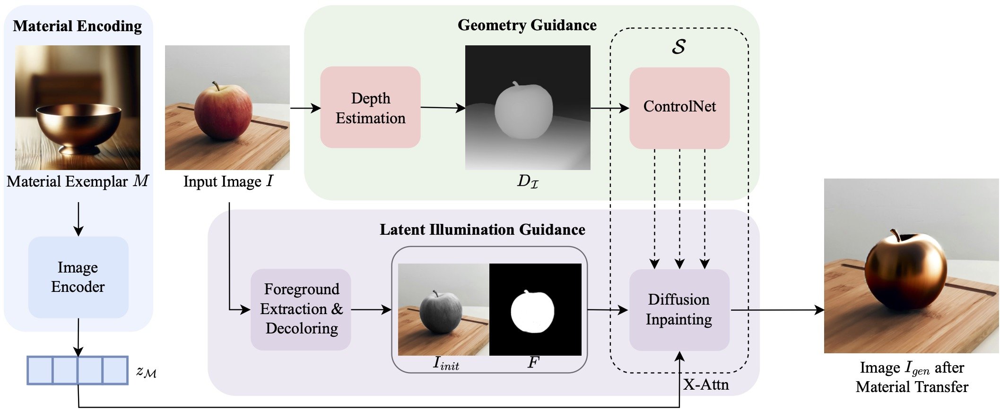
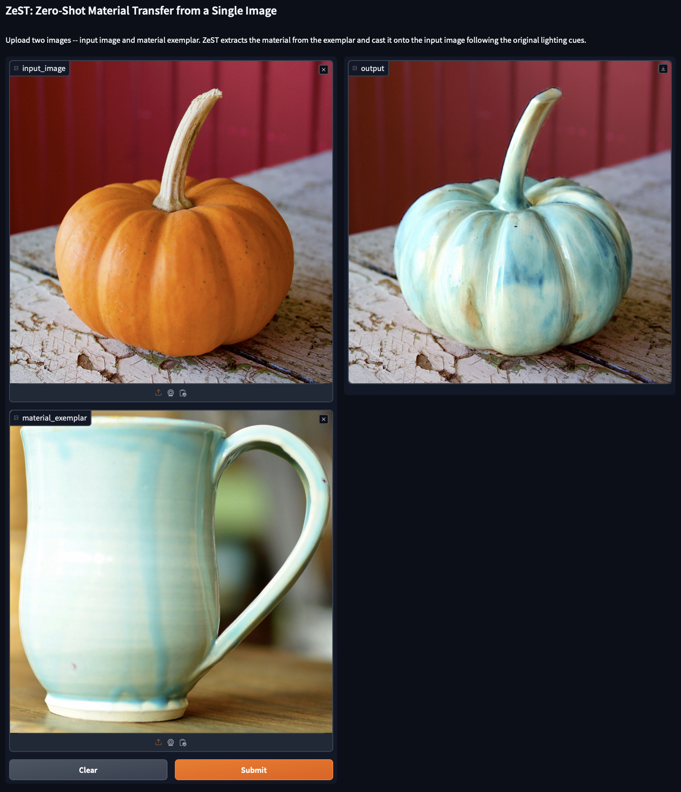

#  ZeST: Zero-Shot Material Transfer from a Single Image

<a href='https://ttchengab.github.io/zest/'></a> 
<a href='https://arxiv.org/abs/2404.06425'></a> 

This is the official implementation of ZeST: Zero-Shot Material Transfer from a Single Image. Given an input image (e.g., a photo of an apple) and a single material exemplar image (e.g., a golden bowl), ZeST can transfer the gold material from the exemplar onto the apple with accurate lighting cues while making everything else consistent.



## Installation
This work is built from the [IP-Adapter](https://ip-adapter.github.io/). Please follow the following instructions to get IP-Adapter for Stable Diffusion XL ready.

We begin by installing the latest diffusers library:

```
pip install diffusers
```

Then clone this repo:

```
git clone https://github.com/ttchengab/zest_code.git
```

Then install IP Adaptor and download the needed models:
```
# install ip-adapter
cd zest_code
git clone https://github.com/tencent-ailab/IP-Adapter.git
mv IP-Adapter/ip_adapter ip_adapter
rm -r IP-Adapter/
```

## Download Models

You can download models from [here](https://huggingface.co/h94/IP-Adapter) and store it by running:

```
# download the models
cd IP-Adapter
git lfs install
git clone https://huggingface.co/h94/IP-Adapter
mv IP-Adapter/models models
mv IP-Adapter/sdxl_models sdxl_models
```

## Demo on Single Image

After installation and downloading the models, you can use `demo.ipynb` to perform material transfer from a single image and material exemplar. We provide one image of each for demonstration.

### Try with your own material exemplar

Simply place the image into `demo_assets/material_exemplars` and change `texture` variable in `demo.ipynb` to the name of the image.

### Try with your own input image

To use your own input images, we would need to borrow depth predictions using DPT.

Install DPT and its dependencies with:

```
git clone https://github.com/isl-org/DPT.git
pip install -r DPT/requirements.txt
```

Place your images inside `DPT/input/` and obtain the results in `DPT/output/` by running:

```
python DPT/run_monodepth.py
```

Afterwards, place all your files from the `DPT/input/` and `DPT/output/` into `demo_assets/input_imgs` and `demo_assets/depths`, respectively. Change `obj` variable in `demo.ipynb` to the name of the input image.

## Run Gradio Demo
To run Gradio demo:

```
python demo_gradio.py
```

It should provide the following interface for you to try. Make sure you install DPT following the section above.



## Inferencing on batch of images
To cross-inference on a set of input images and material exemplars, first create the following directory: 

```
mkdir demo_assets/output_images
```

Follow the above steps to obtain and place all the material exemplars and corresponding input images/depths into their directories.

Then run:

```
python run_batch.py
```

### Visualize results using HTML4Vision

To visualize all the batch results, we utilize the HTML4Vision library, which can be installed with:

```
pip install html4vision
```

Then, run:

```
python visualization.py
```

This will generate an html file `index.html` in the same directory that contains all the results after material transfer.

## Citation
If you find ZeST helpful in your research/applications, please cite using this BibTeX:
```bibtex
@article{cheng2024zest,
  title={ZeST: Zero-Shot Material Transfer from a Single Image},
  author={Cheng, Ta-Ying and Sharma, Prafull and Markham, Andrew and Trigoni, Niki and Jampani, Varun},
  journal={arXiv preprint arXiv:2404.06425},
  year={2024}
}
```
